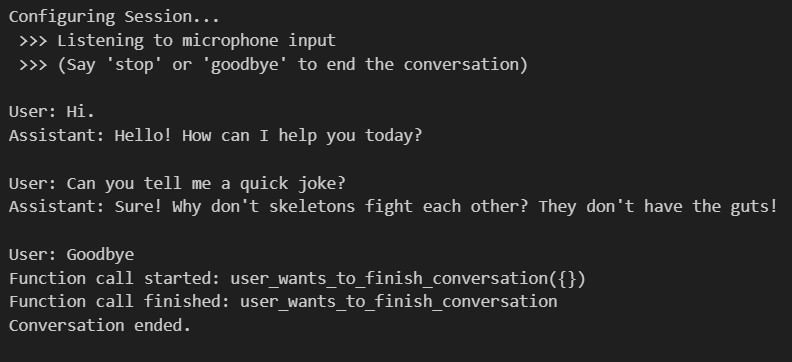

# RxAI: Real-Time AI Conversation with Python and PyRx

RxAI is an advanced real-time AI conversation system developed using Python and PyRx. It integrates cutting-edge AI capabilities to facilitate live, interactive dialogues. The system is designed to leverage the power of OpenAI's language models in combination with reactive programming, enabling fluid and context-aware conversations.

---

## Features

RxAI comes equipped with several powerful features that make it a versatile solution for real-time interactions:

- **Real-time AI conversation**: RxAI processes and responds to user inputs instantly, creating a seamless conversational experience similar to speaking with a human.
- **Function calling**: The system supports dynamic function calling, allowing it to execute specific actions during a conversation based on user intent. For example, it can initiate system commands or trigger other functionalities.
- **Reactive Python implementation**: RxAI leverages reactive programming paradigms using RxPY, making it highly responsive to changes in user input, updates, or any other asynchronous event. This ensures smooth handling of multiple streams of information in real time.

---

## Screenshots



---

## Project Structure

- `rtclient`: Provided by Microsoft ([link](https://github.com/Azure-Samples/aoai-realtime-audio-sdk/tree/6779885d3aaa2ddbed2bbc5dbba74da8cddffca1/python/rtclient)), this package offers low-level components to support real-time AI conversations. It includes:
  - **Session Handling**: Manages conversation sessions, including starting, updating, and ending sessions.
  - **Message Management**: Defines and handles various message types exchanged during conversations.
  - **Testing Utilities**: Includes `client_test.py` to ensure correct behavior of the real-time client.
  - **Model Definitions**: Provides models such as `SessionUpdateMessage` to represent various data structures used in the system.

- `conversation_client.py`: Manages the conversation using `RTClient` and `RxPY` to facilitate real-time AI interactions. It handles:
  - **Session Initialization**: Configures conversation parameters such as turn detection and input transcription.
  - **Event Handling**: Processes various types of events including audio input and AI responses.
  - **Function Calls**: Manages function calls initiated during conversation, and notifies when function calls start and finish.
  - **Subscriptions**: Allows external subscriptions to events like transcription updates, audio updates, and error notifications.

- `microphone_stream.py`: Captures microphone input for real-time audio processing, providing an audio stream for interaction with the AI.

- `speaker_output.py`: Manages audio playback for the AI's response. It includes:
  - **Audio Playback**: Buffers and plays back audio data.
  - **Clearing Playback**: Clears the audio buffer and stops playback as needed.
  - **Dispose Method**: Closes the audio stream to release resources when no longer needed.

- `main.py`: The main script that initializes and runs the conversation client, serving as the entry point for the project. It handles the overall flow of the AI conversation.

- `main.ipynb`: A Jupyter Notebook version of the AI conversation demo, useful for interactive exploration, debugging, or showcasing features step-by-step.

---

## Installation

1. **Create a virtual environment (e.g., `your_venv`)**:

   ```bash
   python -m venv your_venv
   ```

2. **Activate the virtual environment**:

   - **Windows**: `your_venv/Scripts/activate`
   - **Linux/Mac**: `source your_venv/bin/activate`

3. **Install requirements**:

   ```bash
   pip install -r requirements.txt
   ```

4. **Install `rtclient`**:

   ```bash
   pip install -e .
   ```

5. **Set API Key**

    Set `OPENAI_API_KEY` in the `.env` file.

---

## Running the Demo

- Run `main.py` with Python:
  ```bash
  python main.py
  ```
- Alternatively, open and run `main.ipynb` in Jupyter Notebook.

---

## Tips

- To exit the conversation, simply say **"Goodbye"**. This triggers function calling to quit the application.
- Avoid feedback loops by muting your speakers or using headphones to prevent the AI's output from being picked up by the microphone.

---

## How It Works

RxAI operates by integrating real-time audio input with advanced language models to facilitate dynamic and context-aware conversations. Here's a step-by-step overview of how the system works:

1. **Audio Capture**: The `microphone_stream.py` module captures audio input from the user in real time. The audio is streamed to the `conversation_client.py` for processing.

2. **Audio Processing and Transcription**: Using `RTClient`, the captured audio is converted into text transcriptions. These transcriptions are managed through reactive streams using RxPY, enabling efficient handling of updates and modifications.

3. **Real-Time AI Interaction**: Once the transcription is available, the input is passed to OpenAI's language model via the `conversation_client.py`. The AI processes the input to generate a response based on the current context of the conversation.

4. **Function Calling**: Depending on user intent, the system may identify the need to trigger specific actions. This is managed through dynamic function calling, where certain commands are executed automatically during the conversation. Examples include ending the conversation or interfacing with external systems.

5. **Audio Response Playback**: The generated AI response is either played back as audio using the `speaker_output.py` module or displayed as text. This ensures a seamless and interactive experience for the user.

6. **Reactive Updates**: The entire workflow leverages reactive programming to handle changes and updates in real time. This means that as new input or events occur, the system adapts instantly, making the conversation fluid and natural.

7. **Session Management**: The `rtclient` module provided by Microsoft helps manage the session lifecycle, handling configurations, event subscriptions, and maintaining consistent communication throughout the conversation.

Overall, RxAI combines advanced language processing with real-time input/output handling and reactive programming to create a highly interactive and responsive conversational experience.
